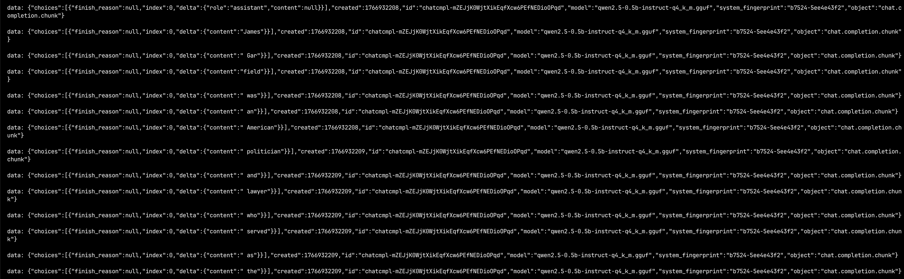
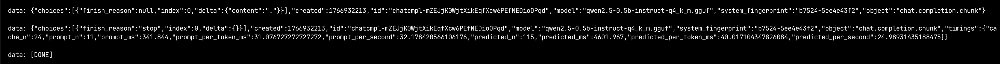
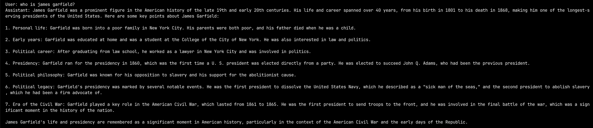

# InferenceForge

im building a llm inference platform to understand streaming, cancellation, observability, canary, autoscaling, GPU serving, distributed training, and safe rollout. im more focused on infra problems.

## system architectre

## gateway

this allows me to talk to an llm and get response in a streaming fashion just like all the chatbots do. i went with sse (server-sent events) as its a one-way client server interaction (a http request, then a long-lived response). anthropic uses [sse](https://docs.anthropic.com/en/api/messages-streaming) when we set `stream: true`. their [helpers](https://github.com/anthropics/anthropic-sdk-typescript/blob/main/helpers.md) shows us how they accumulate data frames (llama.cpp server sends these deltas) and show us the text on the UI.

this is the discovery endpoint to list available models. i can use it as a health check as well.

```bash
curl -sS http://localhost:8097/v1/models
```

and this is the chat interface endpoint.

```bash
curl -N -sS http://localhost:8097/v1/chat/completions \
  -H 'Content-Type: application/json' \
  -d '{"model":"qwen2.5-0.5b-instruct-q4_k_m.gguf","stream":true,"messages":[{"role":"user","content":"who is james garfield?"}]}'
```

once you hit the llm, you start getting frames



and you get a done event.



if you extract the content from these events you get a chatGPT like output.

